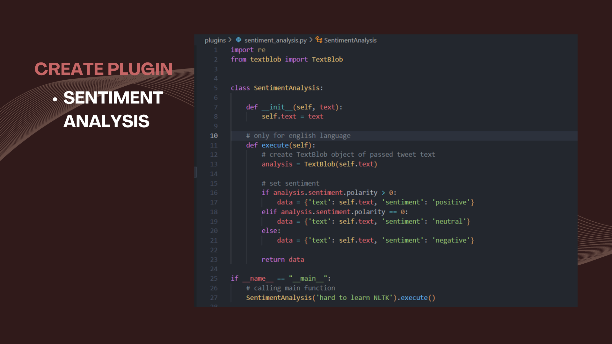
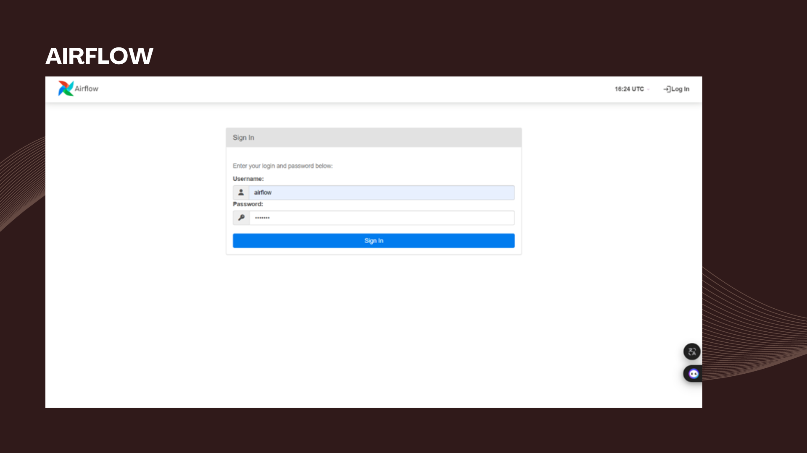

1. Run Airflow using `docker-compose up`
2. Create Plugins:
    - Finnhub loader
    - MongoDB loader
    - Sentiment Analysis
    - Postgres loader
3. Create python code to extract from Finnhub and load to MongoDB
4. Create Python code that Get data from MongoDB and do Sentiment Analysis then load the result to Postgres

