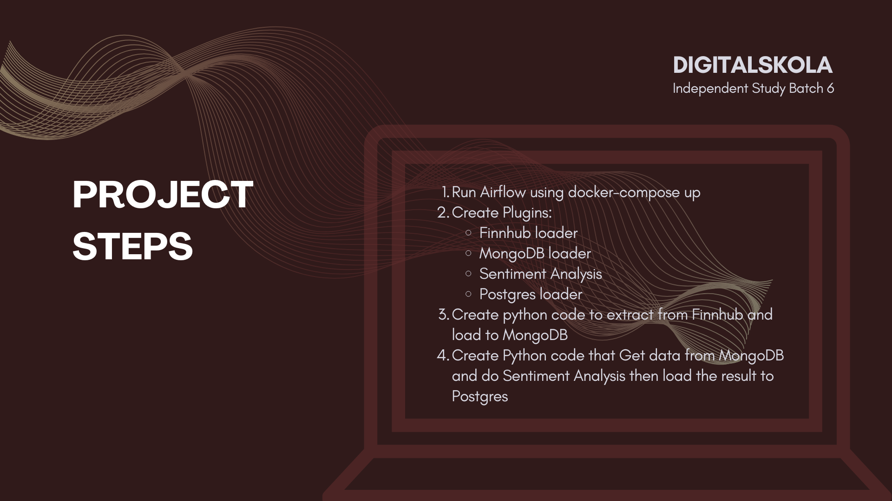

I developed a data pipeline for sentiment analysis on news articles sourced from Finnhub, utilizing Python libraries like TextBlob to assess sentiment. The results were then stored in a structured database. The pipeline was orchestrated using Apache Airflow, initiated with docker-compose up. I created several custom plugins to streamline the process, including a Finnhub loader to retrieve news data, a MongoDB loader to store raw data, a sentiment analysis module, and a Postgres loader to store the processed sentiment data. The process involved writing Python code to extract news data from Finnhub and load it into MongoDB, followed by another script to fetch the data from MongoDB, perform sentiment analysis, and load the results into a Postgres database.

Step of the works:
1. Run Airflow using `docker-compose up`
2. Create Plugins:
    - Finnhub loader
    - MongoDB loader
    - Sentiment Analysis
    - Postgres loader
3. Create python code to extract from Finnhub and load to MongoDB
4. Create Python code that Get data from MongoDB and do Sentiment Analysis then load the result to Postgres

